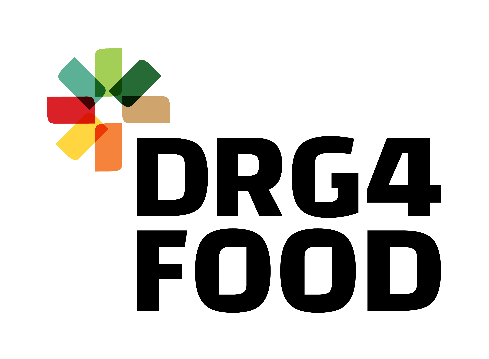

# NutriSight

## Dataset management

Every script related to dataset management and generation is located in the `dataset` directory.

## Export

To export the model to ONNX format, create a virtualenv with the following dependencies:

```bash
pip install onnx==1.16.2 onnxruntime==1.19.2 torch==2.4.1+cpu transformers==4.44.2 optimum==1.22.0
```

Then run the following command:

```bash
optimum-cli export onnx -m openfoodfacts/nutrition-extractor --opset 19 --task token-classification nutrition-extractor-onnx-19
```

## Thanks to our sponsors!

The NutriSight project has indirectly received funding from the European Union’s Horizon Europe research and innovation action programme, via the DRG4FOOD – Open Call #1 issued and executed under the DRG4FOOD project (Grant Agreement no. 101086523).

  
